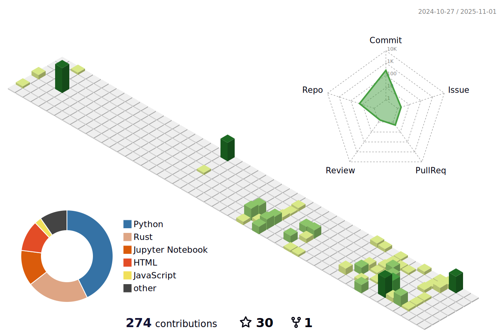

<!-- README.md for github.com/notPhani -->

░█▀█░█░█░█▀█░█▀█░█▀█░█▀█░█▀▄░░░█▀▄░█▀█░█▀█░█▀▄░█▀█  
░█▀▀░█░█░█▀▀░█░█░█░█░█▀█░█▀▄░░░█▀▄░█▀█░█▀█░█▀▄░█▀█  
░▀░░░▀▀▀░▀░░░▀▀▀░▀▀▀░▀░▀░▀▀░░░░▀▀░░▀░▀░▀░▀░▀░▀░▀░▀

# 🧠 `Initializing Phani.exe`  
### *“Debugging life one cosmic compile at a time.”*

---

Initializing environment...
Checking caffeine levels............................ OK
Compiling "ASTRA" .................................. SUCCESS
Training "BakeLight" neural radiance core........... STABLE
Rendering "Caveman Board" physics engine............ RUNNING
Building YouTube module: ChillarCode................ ACTIVE
LinkedIn Sync ...................................... PENDING (updating)
Sanity Check ....................................... FAILED (as expected)
Ready.

text

## 💼 About Me
👋 Hey there! I’m Vikram (Phani) —  
a developer who likes his code like his coffee:  
strong, slightly unstable, and running 60 FPS on a potato.  

🧭 Currently exploring:  
- AI-enhanced rendering (BakeLight) ☀️  
- Spectral transformers for galaxies (ASTRA) 🌌  
- Compiler experiments & low-level chaos (C→BF in Rust) ⚙️  
- AI playing games & generating chaos (ChillarCode YouTube) 🎮 
- Physics simulation world (Caveman Board) 🧱  

💡 Vision: To bridge high-performance physics, ML, and art —  
and ship it like a mad scientist who found AWS credits.

---

## ⚙️ Tech Arsenal  
### Comfort Zone:  
AI/ML • Compilers • Ray Tracing • Distributed Systems • UI Engineering  

### Current Stack & Badges:  
  
  
  
PyTorch | Mitsuba 3 | Svelte | Go | Supabase | Blender  

> “I don’t chase frameworks. They come to me broken and I fix them.”

---

## 🚀 Projects (aka proof I don’t just sleep)  

| Project | Description | Stack |  
|---------|-------------|-------|  
| [BakeLight](https://github.com/notPhani/BakeLight) | Neural irradiance field approximator — mixes deep learning and physics to make light look smarter. | PyTorch, Mitsuba 3, NumPy |  
| [ASTRA](https://github.com/notPhani/ASTRA) | Spectral transformer predicting galaxy redshifts. Custom RoPE + MoE + multi-latent attention. | PyTorch, SciPy |  
| [C→BF (Rust)](https://github.com/notPhani/c2bf-in-RUST) | A C subset compiler that outputs Brainfuck. Insanity powered by regex and coffee. | Rust |  
| [Caveman Board](https://github.com/notPhani/Caveman-Board) | Multiplayer physics world built from scratch with adaptive spatial splits. | Go, Svelte, Supabase |  
| AI Plays Level Devil | An evolutionary algorithm trying to survive the world’s meanest platformer. | Python, OpenCV |

---

## 🧩 Stats That Look Fancy But Mean Sleep Loss  
*"My commit graph looks like an EKG reading from a caffeine addict."*

---

## 🧱 3D Contribution Tracker

<!-- Embed your 3D contribution SVG chart here once generated by your action -->

---

## 📜 Boot Log (Extended Version)
Deploying personal growth...
Meditation routine..............IN PROGRESS
Anger management................OK
Masturbation cooldown...........ACTIVE (Hanuman mode)
Cracker consumption.............LIMITED (eco mode)
Resume update...................DONE ✅
Internship target...............AMAZON or NETFLIX
Universe alignment..............SYNCHRONIZED

---

## 🛰️ The Story So Far  
Started out fixing bugs that weren’t mine.  
Now I break frameworks for research, and write about it like it’s poetry.  
Each repo here is a piece of my brain thrown into the cloud.  
Some code for science.  
Some code for chaos.  
All code for curiosity.

---

## 🌟 Connect & Collaborate  
💼 [LinkedIn](https://linkedin.com/in/your-link)  
📹 [YouTube: ChillarCode](https://youtube.com/@ChillarCode)  
🌐 [Portfolio (coming soon... maybe)](https://chatgpt.com/c/68e57647-75b0-8323-a1d8-029c3bb05ed1#)

---

💡 **Tip:**  
Once you paste this in your `README.md`, go to GitHub → `notPhani/notPhani` → Settings → turn on **“Public Profile README”**.  
Then boom 💥 — Amazon engineers will see a boot log instead of a boring profile.

---

### Animated Badges & Visuals (add these lines where you want them displayed)  
  

